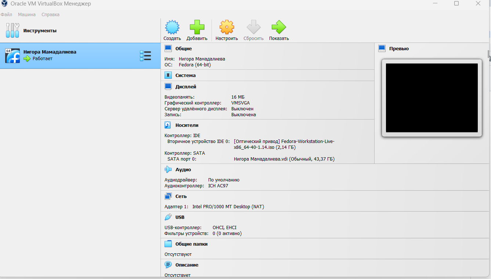
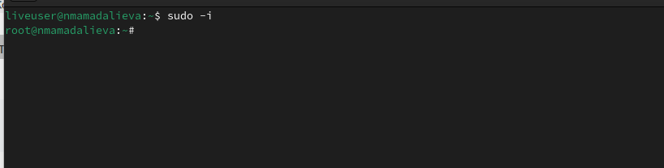

# Лабораторная работа №1
# Цель работы 
```
Целью данной работы является приобретение практических функций установки сетевых систем на виртуальную машину, настроенных минимально минимально для дальнейшей работы сервисов.
```
# Выполнение рабораторной работы
1. Установленная ОС Linux Fedora на виртуальную машину VirtualBox:


2. Выполнен вход в учетную запись, открыт терминал, произведено переключение на роль root-пользователя:


3. Обновим все пакеты:
```
 dnf -y update
```
Я пыталась минимум 5 раз повторно устанавливать ОС, удаляя предыдущий. И каждый раз он обновлял пакеты 1,5-2 часа, потом выводил ошибку "Error Summary"
Из-за того, что я пыталась это исправить, не заскринила. Переводчик переводил, что недостаточно памяти, при повторном создании я увеличивала память, не помогло.
Надо было дальше делать лабы,не застревать, а я думала, что они взаимосвязаны, без обновление пакетов дальше не смогу работать

# Контрольные вопросы
1. Какую информацию содержит учётная запись пользователя?
```
 - имя пользователя
 - пароль
```
2. Укажите команды терминала и приведите примеры:
- для получения справки по команде:
```
 команда: man
 пример: man mkdir
```
- для перемещения по файловой системе:
```
 команда: cd
 пример: cd /etc
```
- для просмотра содержимого каталога:
```
команда: ls
пример: ls -l
```
- для определения объёма каталога:
 ```
команда: du
пример: du /etc
``` 
- для создания (удаления) каталогов:
 ```
команда: mkdir (rmdir)
пример: mkdir (rmdir) /doc
```
- для создания (удаления) файлов:
 ```
команда: touch (rm)
пример: touch (rm) list1.txt
``` 
- для задания определённых прав на файл / каталог:
 ```
команда: chmod
пример: chmod g+w list1.txt
``` 
- для просмотра истории команд:
 ```
команда: history
```
3. Что такое файловая система? Приведите примеры с краткой характеристикой.
```
Файловая система – это инструмент, позволяющий управлять системой и программами, обращаясь к нужным файлам и работая с ними. В этой программе используются только название файла, его размер и дата создания.

FAT32 FAT – одна из старых файловых систем, которая была разработана еще в 1977 году программистами компании Microsoft для гибких дисков.

NTFS Структура системы хранения данных имеет вид бинарного дерева. В отличие от иерархической, как в FAT32, доступ к информации осуществляется по запросу, поиск осуществляется по названию файла. В этой системе имеется каталог, отсортированный по названиям. Массив разделен на 2 части и отсек, в котором данный файл не будет, оставшаяся часть также разделена на 2, и так далее до тех пор, пока не будет найден нужный файл.
```
4. Как посмотреть, какие файловые системы подмонтированы в ОС?
```
команда: findmnt
```
5. Как удалить зависший процесс?
```
команда: kill
команда: killall
```
