# Лабораторная работа №4
# Цель работы

Приобретение практических навыков взаимодействия пользователя с системой посредством командной строки.

# Теоретические сведения

В операционной системе типа Linux взаимодействие пользователя с системой обычно
осуществляется с помощью командной строки посредством построчного ввода команд. 
При этом обычно используется командные интерпретаторы языка shell: ```/bin/sh; /bin/csh; /bin/ksh.```

Командой в операционной системе называется записанный по
специальным правилам текст (возможно с аргументами), 
представляющий собой указание на выполнение какой-либо 
функций (или действий) в операционной системе.
Обычно первым словом идёт имя команды, остальной текст — аргументы или опции,
конкретизирующие действие. Общий формат команд можно представить следующим образом:

```<имя_команды><разделитель><аргументы>```

* Команда man используется для просмотра (оперативная помощь) в диалоговом режиме руководства (manual) по основным командам операционной системы типа Linux.

* Команда cd. Команда cd используется для перемещения по файловой системе операционной системы типа Linux.

* Команда pwd. Для определения абсолютного пути к текущему каталогу используется команда pwd (print working directory).

* Команда ls. Команда ls используется для просмотра содержимого каталога.

* Команда mkdir. Команда mkdir используется для создания каталогов.

* Команда rm. Команда rm используется для удаления файлов и/или каталогов.

# Выполнение лабораторной работы

1. Определим полное имя нашего домашнего каталога. При помощи команды  cd перейдем в домашний каталог.
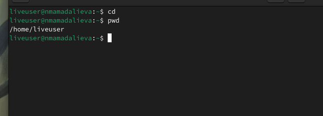{ #fig:004 width=70}

2.1 Перейдем в каталог /tmp, с помощью команды cd /tmp.
2.2 Выведем на экран содержимое каталога /tmp. Для этого используем команду ls с различными опциями.

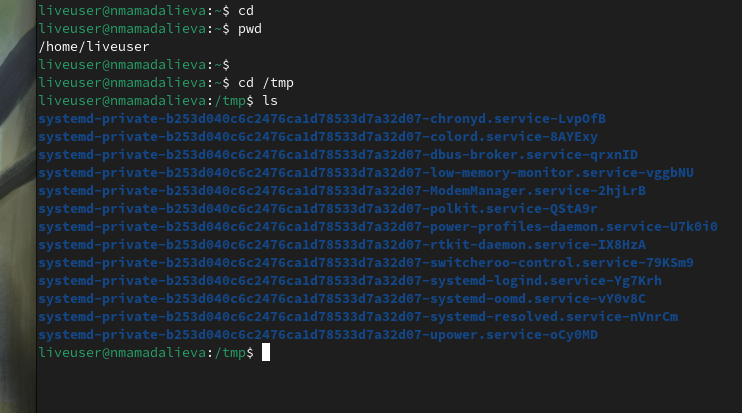{ #fig:002 width=70% }

Мы можем увидеть содержимое каталога со скрытыми файлами применив опцию -a

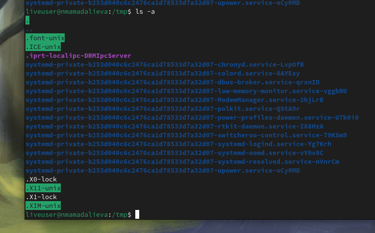{ #fig:003 width=70% }

Мы можем увидеть подобный каталог критериев, применив опцию -l
  
  Применив опцию -f можем увидеть файлы списком

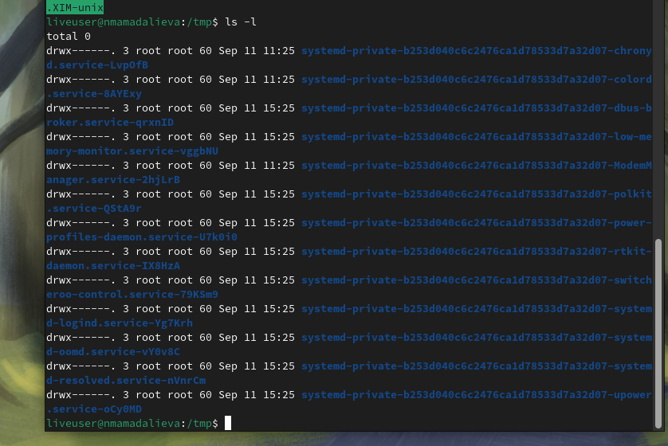{ #fig:004 width=70% }

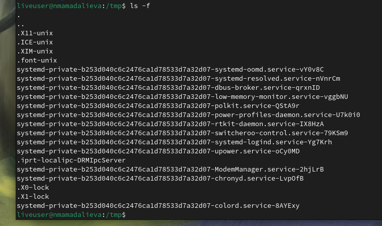{ #fig:005 width=70% }

2.3. Определили, есть ли в каталоге /var/spool подкаталог с именем cron.

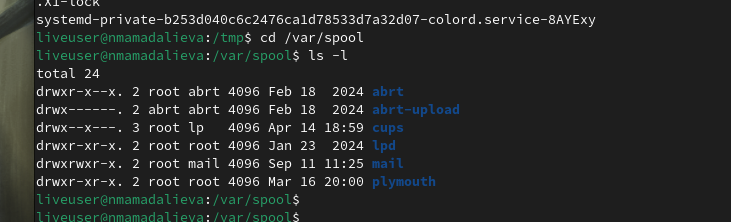{ #fig:006 width=70% }

2.4. Перешли в домашний каталог и вывели на экран его содержимое. 
Определили, кто является владельцами файлов и подкаталогов посредством команды ls -al. 
Большинство файлов принадлежат моему полбзователю и root.    

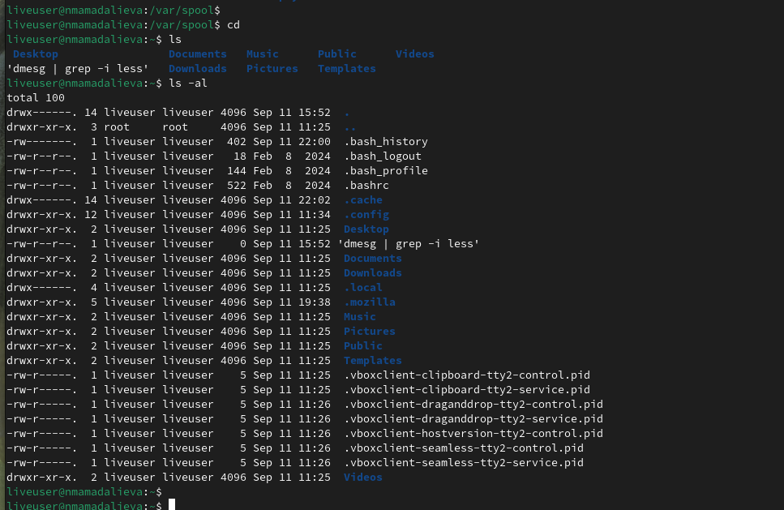{ #fig:007 width=70% }

3.1. В домашнем каталоге создали новый каталог с именем newdir при помощи команды mkdir
3.1. В домашнем каталоге создается новый каталог с именем newdir при помощи команды mkdir.

3.2. В каталоге ~/newdir создается новый каталог с названием morefun.

3.3. В домашнем каталоге создается три новых каталога с именами букв, заметок, ошибок, а затем удаляются эти каталоги одной командой по конструкции rm -r [имена файлов].

3.4. В задании к лабораторной предпосылке, что каталог /newdir не получится удалить команду rm. Для этого сначала надо стойкий каталог /newdir от подкаталога morefun. 
Но если использовать ключ -r к группе rm, то все тогда удалится, не обращая внимания на подкаталоги.
  
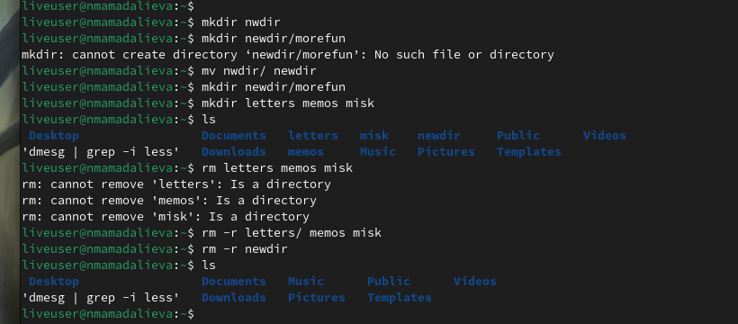{ #fig:007 width=70% }

4. С помощью команды man определим, какую опцию команды ls необходимо использовать для просмотра критериев не только указанного каталога, но и подкаталогов, входящих в него. Введя в консоль man ls, мы получаем справку на английском языке и в ней нужен ключ к команде. Это ключ -R

5. Также с помощью команды man, определившей набор опций ls, команда может отсортировать за последние изменения итоговый список каталога с развёрнутым описанием файлов. Введя в консоль man ls, мы получаем справку на английском языке и в ней нужен ключ к команде. Это ключ -t.
6. Bспользовать команду man для просмотра описаний разных команд

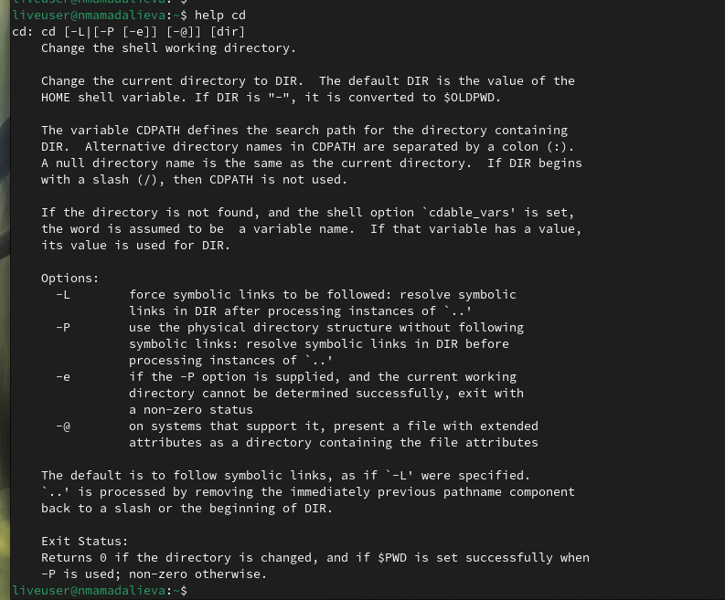{ #fig:007 width=70% }
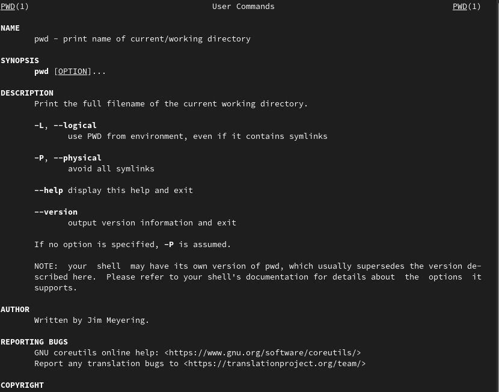{ #fig:007 width=70% }
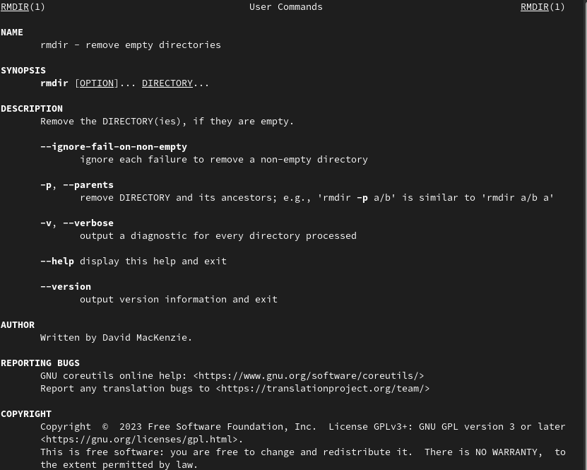{ #fig:007 width=70% }
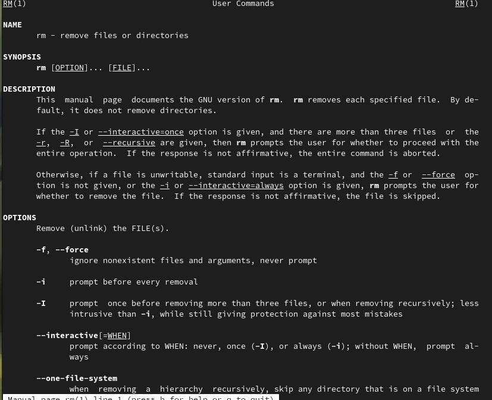{ #fig:007 width=70% }
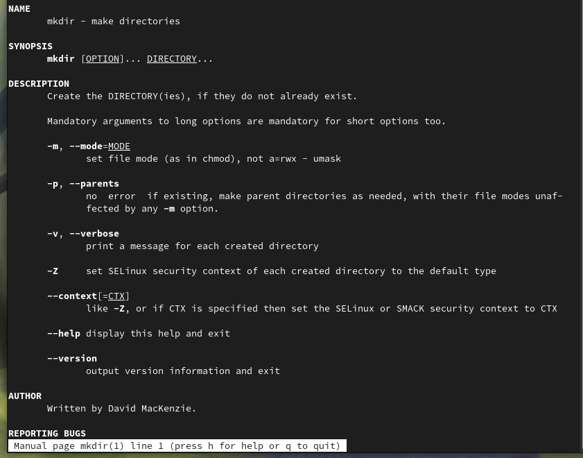{ #fig:007 width=70% }

7. Используем информацию, полученную с помощью команды истории, выполним модификацию и исполнение нескольких команд из буфера команды.
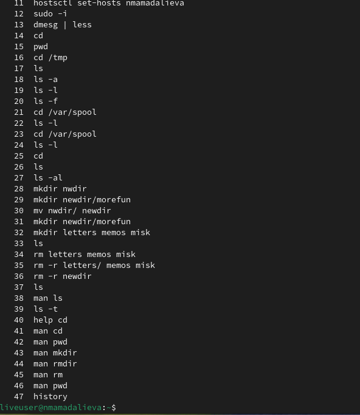{ #fig:007 width=70% }

# Вывод
```
Мы приобрели практические навыки взаимодействия с пользователем с помощью командной строки.
```
# Контрольные вопросы
1. Что такое командная строка?
```
- интерфейс для взаимодействия пользователя с операционной системой 
```
2. При помощи какой команды можно определить абсолютный путь текущего каталога?
Приведите пример.
```
команда: pwd
пример:
(абсолютное имя текущего каталога пользователя dharma):
pwd
результат:
/afs/dk.sci.pfu.edu.ru/home/d/h/dharma
```
3. При помощи какой команды и каких опций можно определить только тип файлов
и их имена в текущем каталоге? Приведите примеры.
```
команда: ls
пример:
cd
cd ..
pwd
/afs/dk.sci.pfu.edu.ru/home/d/h
ls
dharma
```
4. Каким образом отобразить информацию о скрытых файлах? Приведите примеры.
```
команда: ls -alF
пример:
drwxr-xr-x 21 root root 4096 Jan. 17 09:00 ./
drwxr-xr-x 21 root root 4096 Jan. 17 09:00 ../
drwxr-xr-x 2 root root 4096 Jan. 18 15:57 bin/
drwxr-xr-x 2 root root 4096 Apr. 14 2008 boot/
drwxr-xr-x 20 root root 14120 Feb. 17 10:48 dev/
drwxr-xr-x 170 root root 12288 Feb. 17 09:19 etc/
drwxr-xr-x 6 root root 4096 Aug. 5 2009 home/
lrwxrwxrwx 1 root root 5 Jan. 12 22:01 lib -> lib64/
drwxr-xr-x 8 root root 4096 Jan. 30 21:41 media/
drwxr-xr-x 5 root root 4096 Jan. 17 2010 mnt/
drwxr-xr-x 25 root root 4096 Jan. 16 09:55 opt/
dr-xr-xr-x 163 root root 0 Feb. 17 13:17 proc/
drwxr-xr-x 31 root root 4096 Feb. 15 23:57 root/
drwxr-xr-x 2 root root 12288 Jan. 18 15:57 sbin/
drwxr-xr-x 12 root root 0 Feb. 17 13:17 sys/
drwxrwxrwt 12 root root 500 Feb. 17 16:35 tmp/
drwxr-xr-x 22 root root 4096 Jan. 18 09:26 usr/
drwxr-xr-x 17 root root 4096 Jan. 14 17:38 var/
```
5. При помощи каких команд можно удалить файл и каталог? Можно ли это сделать
одной и той же командой? Приведите примеры.
```
команда: rm -r
пример:
cd
mkdir abs
rm abc
rm: abc is a directory
rm -r abc
```
6. Каким образом можно вывести информацию о последних выполненных пользователем командах? работы?
```
команда: history
пример:
history
1 pwd
2 ls
3 ls -a
4 ls -l
5 cd /
6 history
```
7. Как воспользоваться историей команд для их модифицированного выполнения? Приведите примеры.
```
Tab
```
8. Приведите примеры запуска нескольких команд в одной строке.
```
firefox & telegram-dekstop
```
9. Дайте определение и приведите примера символов экранирования.
```
Экранирование заключается в добавлении спецсимволов перед символами или строками для предотвращения их некорректной интерпретации,
например, добавление символа \ перед " (двойными кавычками) позволяет интерпретировать их в качестве части текста, а не в качестве обозначения окончания строки.
```
10. Охарактеризуйте вывод информации на экран после выполнения команды ls с опцией l.
```
- вывод подробной информации, включая права пользователей размер файла и авторство и число ссылок
```
11. Что такое относительный путь к файлу? Приведите примеры использования относительного и абсолютного пути при выполнении какой-либо команды.
```
Относительный путь — это путь к файлу относительно текущего каталога. Текущий каталог — это тот, в котором запускается скрипт, программа.
пример:
cd /home/username
cd ~
cd ../username
```
12. Как получить информацию об интересующей вас команде?
```
- `man <command>`
```
13. Какая клавиша или комбинация клавиш служит для автоматического дополнения
вводимых команд?
```
- tab
```
